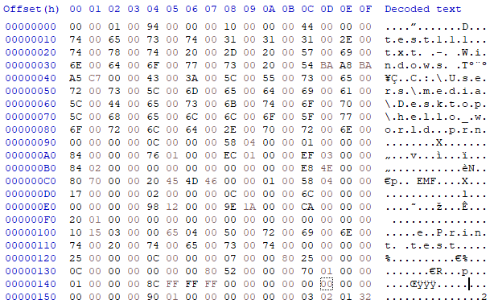
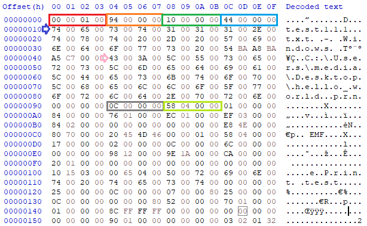

# EMF_SPL-to-EMF
EMF 스풀링된 파일에서 EMF 파일로 추출하는 프로그램

[레퍼런스](https://docs.microsoft.com/en-us/openspecs/windows_protocols/ms-emfspool/e81c69ef-038d-43a7-b294-2328e5ce1cec)

## 목적

- 프린터로 출력될 파일이 프린터 전용 spool 폴더에 임시보관 되는데 이 때 파일의 정보를 추출하기 위함

### EMF-SPL 파일 

- 같이 첨부된 `00035.SPL` 참조
- 해당 파일은 `Hello World` 텍스트를 메모장으로 작성한 후 인쇄 버튼을 눌렀을 때 EMF 스풀링 사용 허용된 프린터에서 발생한 `SPL`, `SHD` 파일 중 `SPL` 만 사용함

### 사용한 툴

- HxD
- Visual Studio 2015

#### 헤더

- 중요 항목 표시 전

- 중요 항목 표시 후

-RED-

> 파일의 버전을 나타내며 4byte 를 가지고 있음 `0x00010000`

-Orange-

> EMF 데이터 위치를 나타내며 4byte 를 가지고 있음 `0x00000094`

-Green-

> 출력물의 이름 위치를 나타내며 4byte 를 가지고 있음 `0x00000010`

-Blue-

> 출력 추출물의 기기 이름을 나타내며 4byte 를 가지고 있음 `0x00000044`

-Gray-

> EMF 데이터 영역이 시작함을 알리는 고유 데이터를 4byte 를 가지고 있음 `0x0000000C`

-Light Green-

> EMF 데이터의 크기에 대한 정보 4byte 를 가지고 있음 `0x00000458`

### 프로그램 한 줄 설명

EMF 데이터의 크기에 대한 정보를 가진 4byte 이후로 EMF 데이터 크기 만큼 byte array로 가져와 EMF 파일로 만든 후 저장함